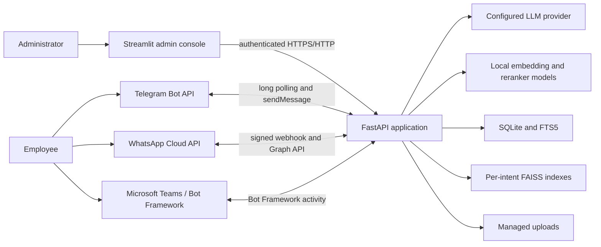
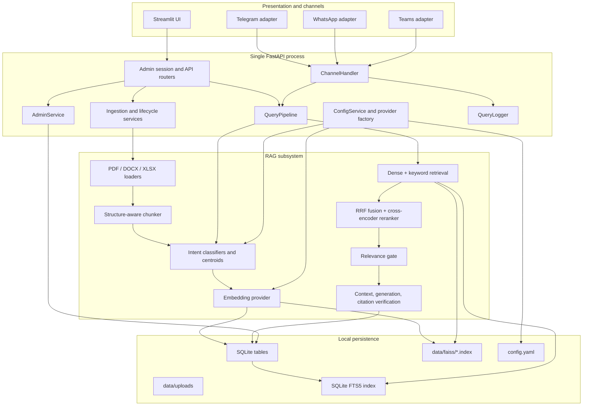
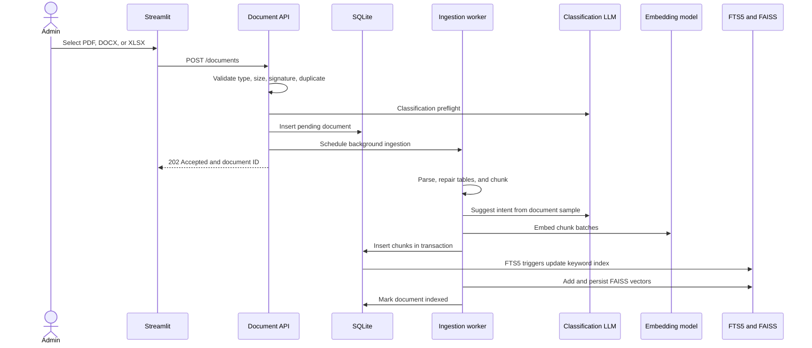
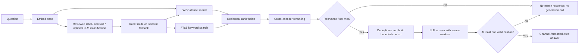
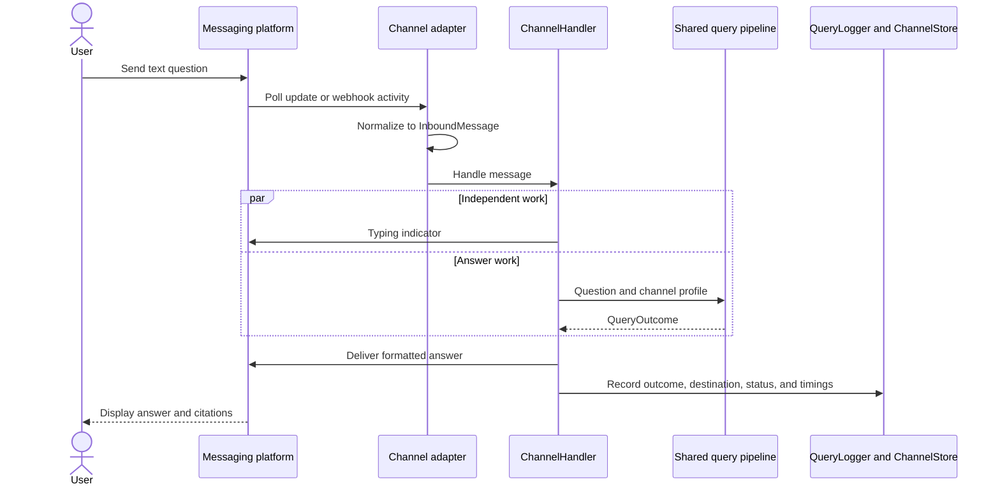

# IntelliKnow System Design

This document describes the implemented IntelliKnow MVP: its runtime
components, the responsibility of each component, and the interactions that
turn source documents into cited answers. It is a code-level architecture
guide, while the [Deployment Guide](DEPLOYMENT.md) and
[Messaging Integrations Guide](INTEGRATIONS.md) focus on operating the system.

## 1. Design Goals and Scope

IntelliKnow is a small-company knowledge management system designed to run on
one laptop. It provides a web administration console and three messaging
frontends over one shared retrieval-augmented generation (RAG) pipeline.

The design prioritizes:

- source-grounded answers with verified citations;
- observable document processing and query behavior;
- configurable intent routing with a safe General fallback for uncertainty;
- local persistence and reproducible deployment;
- one implementation of business logic shared by every frontend; and
- an MVP-sized operational footprint with no queue, cache cluster, or cloud
  database.

The supported deployment is one Streamlit process and one FastAPI process
with one API worker. SQLite, the in-memory FAISS indexes, background ingestion,
and channel polling are intentionally coordinated inside that single API
process.

## 2. System Context



The FastAPI application is the system boundary and sole owner of business
logic and persistent state. Streamlit is deliberately an API client: it never
opens SQLite or FAISS directly. Telegram, WhatsApp, Teams, and the Dashboard
test-query screen all invoke the same query pipeline, so routing and answer
quality do not vary by frontend.

## 3. Runtime Architecture



`app/main.py` is the application composition root. At startup it creates one
shared SQLAlchemy engine and one shared `VectorStore`, then injects those
objects into ingestion, querying, administration, analytics, and channel
services. Sharing the vector store is important because indexes are cached in
memory after first use; separate write-side and read-side instances could
otherwise disagree until restart.

## 4. Component Responsibilities

### 4.1 Presentation and API

| Component | Implementation | Responsibility and interactions |
|---|---|---|
| Admin console | `app/ui/streamlit_app.py` | Renders Dashboard, Frontend Integration, Knowledge Base, Intent Configuration, and Analytics. Calls the API through `APIClient`; holds no database or index logic. |
| UI API client | `app/ui/client.py` | Adds the admin bearer token, handles HTTP/HTTPS certificate verification, uploads files, and converts transport failures into readable UI errors. |
| FastAPI composition | `app/main.py` | Builds shared dependencies, registers routers and public channel endpoints, starts Telegram polling, warms channel/model resources, and recovers interrupted documents. |
| Admin authentication | `app/api/auth.py` | Validates the bootstrap password and issues signed eight-hour sessions. Protects all administrative routers at the router boundary. |
| Document API | `app/api/documents.py` | Validates uploads, records document state, schedules background ingestion, and exposes list, detail, reparse, reassign, delete, and reindex operations. |
| Query API | `app/api/query.py` | Runs an administrator's test question through the production query pipeline and records its result. |
| Admin API and service | `app/api/admin.py`, `app/admin/service.py` | Manages live thresholds and intent spaces, classification reviews, dashboard summaries, query history, analytics, and CSV export. |
| Integration API | `app/api/integrations.py` | Saves masked channel configuration, enables or disables adapters, exposes health state, and triggers test deliveries. |

### 4.2 Configuration and AI Providers

| Component | Implementation | Responsibility and interactions |
|---|---|---|
| Bootstrap | `app/bootstrap.py` | Loads `.env` before configuration, validates required secrets, constructs classify/generate LLMs and the embedding provider, and prevents incompatible embedding models from opening an existing index. |
| Configuration model | `app/config.py`, `config.yaml` | Defines validated provider, RAG, routing, intent, channel, ingestion, and storage settings. |
| Live configuration | `app/config_service.py` | Applies supported runtime changes atomically and persists them to YAML. Guards reject changes that would invalidate indexes or intent routing. |
| Provider factory | `app/providers/factory.py` | Selects Anthropic, OpenAI, or local OpenAI-compatible LLM implementations and local or OpenAI embeddings from configuration. |
| Provider adapters | `app/providers/*_llm.py`, `app/providers/*_embedding.py` | Normalize provider behavior behind `LLMProvider` and `EmbeddingProvider`, enforce output schemas, classify errors, apply timeouts/retries, and normalize vectors. |

The classification and generation roles may use different configured models,
but both expose the same provider interface. This keeps orchestration and RAG
code independent of a vendor SDK.

### 4.3 Document Ingestion and Lifecycle

| Component | Implementation | Responsibility and interactions |
|---|---|---|
| Upload validation | `app/ingest/validate.py` | Enforces filename, extension, size, content signature, and duplicate rules before a document row or managed file is created. |
| Format loaders | `app/rag/loaders/` | Convert PDF, DOCX, and XLSX content into ordered prose, heading, and table `Block` objects while retaining page, section, sheet, and cell references. |
| Table handling | `app/rag/tables.py`, `app/rag/blocks.py` | Preserves clean tables as Markdown and sends only structurally ragged tables for schema-constrained repair. |
| Chunker | `app/rag/chunker.py` | Groups content by heading, splits prose near configured character targets with overlap, and keeps table headers/source references with table fragments. |
| Document classifier | `app/ingest/classify_doc.py` | Samples parsed content and asks the classify LLM for a validated intent. Provider errors, invalid output, and insufficient confidence fail the upload before indexing. |
| Index writer | `app/rag/index_writer.py` | Embeds chunks and coordinates chunk rows, FTS5 triggers, and FAISS mutation. It compensates failed FAISS writes so SQL and persisted vectors remain aligned. |
| Lifecycle service | `app/ingest/lifecycle.py` | Re-parses source files, moves a document between intent indexes without re-embedding, deletes all indexed content, and atomically rebuilds all indexes. |

FastAPI `BackgroundTasks` runs ingestion, reparse, and full reindex work after
returning `202 Accepted`. This is sufficient for the one-worker MVP and gives
the UI visible `pending`, `parsing`, `indexed`, or `failed` states without a
separate message broker.

### 4.4 Query Orchestration and RAG Read Path

| Component | Implementation | Responsibility and interactions |
|---|---|---|
| Pipeline coordinator | `app/orchestrator/pipeline.py` | Executes every query stage in order, reuses the query embedding, records stage timings, and returns one `QueryOutcome` for all frontends. |
| Reviewed examples | `app/orchestrator/feedback.py` | Loads administrator labels from query history. Exact reviewed questions route deterministically, while all valid examples also improve intent centroid and LLM context. |
| Intent centroids | `app/orchestrator/centroids.py` | Builds one normalized semantic prototype per intent from its description, keywords, and reviewed examples; converts similarities to confidence scores. |
| Query classifier | `app/orchestrator/classify.py` | Checks exact reviewed labels, then uses the local centroid fast path, escalating uncertain queries to a schema-constrained LLM when configured. |
| Router | `app/orchestrator/route.py` | Searches the accepted intent or routes a valid below-threshold result to the configured General space. Invalid output or provider failure fails closed instead of silently misrouting. |
| Dense retrieval | `app/rag/retrieve/dense.py`, `app/rag/vector_store.py` | Searches the selected intent's unit-normalized FAISS inner-product index using the query vector already produced for classification. |
| Keyword retrieval | `app/rag/retrieve/keyword.py`, `app/rag/fts_query.py` | Searches the same intent through SQLite FTS5, preserving exact terms that semantic retrieval may underweight. |
| Fusion | `app/rag/retrieve/fuse.py` | Combines dense and keyword ranks with reciprocal-rank fusion and emits a bounded reranking pool. |
| Reranker | `app/rag/retrieve/rerank.py` | Applies the local `cross-encoder/ms-marco-MiniLM-L-6-v2` model to query/chunk pairs and returns the configured final top K. |
| Relevance gate | `app/rag/retrieve/gate.py` | Stops the pipeline before generation when the best reranked evidence is below `relevance_floor`. |
| Context builder | `app/rag/context.py` | Loads chunk metadata, removes near duplicates, respects the context budget, and assigns source markers to selected evidence. |
| Answer generator | `app/rag/generate.py` | Prompts the generation LLM to answer only from supplied evidence and to attach the provided source markers. |
| Citation verifier | `app/rag/citations.py` | Accepts only markers present in the context bundle, converts them to source metadata, and rejects an uncited generated answer as no-match. |
| Channel formatter | `app/rag/format.py` | Escapes markup, formats citations, and enforces each channel's length and presentation profile. |

## 5. Main Interaction Flows

### 5.1 Document Write Path



If any processing stage fails, the worker removes partial chunks and vectors,
marks the document `failed`, and leaves the original upload available for an
administrator to inspect and retry. On API restart, documents interrupted in a
non-durable processing state are marked failed with a retryable explanation.

### 5.2 Query and RAG Read Path



The query vector is computed exactly once and reused for centroid
classification and dense retrieval. A high-confidence centroid route avoids a
classification network call. An uncertain but valid classification may use the
General fallback; an unavailable or malformed classifier produces a retryable
error. The relevance gate avoids both unsupported answers and unnecessary
generation calls.

### 5.3 Messaging Channel Path



Adapters contain platform-specific normalization, authentication, and delivery
only. `ChannelHandler` provides common text validation, concurrent typing
notification, blocking-pipeline isolation, delivery failure handling, status
updates, and logging. Telegram receives updates by long polling; WhatsApp and
Teams expose webhook endpoints.

### 5.4 Admin-Guided Classification Improvement

1. Every query records its selected intent, confidence, classifier source,
   fallback status, answer result, evidence, and latency.
2. In Intent Configuration, an administrator assigns the expected intent to a
   representative query.
3. The label is stored on that query history row and included in subsequent
   centroid construction and LLM classification prompts.
4. An exact repeat of the reviewed question routes directly with
   `classified_by=review`; semantically related questions benefit from the
   updated centroid.
5. Reviewed outcomes, rather than unverified model predictions, drive the
   displayed classification accuracy.

## 6. Data Ownership and Consistency

| Store | Data | Owner and consistency rule |
|---|---|---|
| `data/intelliknow.db` | Documents, chunks, query history and reviews, integration state, encrypted credentials, integration errors | FastAPI through SQLAlchemy. Foreign keys are enabled on every connection and WAL mode supports the UI/channel read-write pattern. |
| SQLite `chunk_fts` | Full-text index over chunk text | External-content FTS5 table maintained by insert/update/delete triggers on `chunks`; callers never update it independently. |
| `data/faiss/*.index` | One exact cosine-similarity vector index per intent | Shared `VectorStore`, serialized by a process-wide re-entrant lock and persisted after mutations. FAISS IDs are SQLite `chunks.id` values. |
| `data/uploads` | Managed copies of accepted source files | Document lifecycle service; names use document IDs to avoid unsafe user paths and collisions. |
| `config.yaml` | Non-secret provider choices, thresholds, intent definitions, channel modes, and paths | `ConfigService`; supported live edits are validated before atomic persistence. |
| `.env` | Provider keys, admin bootstrap password, credential-encryption key, and optional proxy settings | Bootstrap only. It is local, excluded from Git, and never returned through an API. |

The central index invariant is: each indexed chunk has one SQLite row, one
FTS5 entry maintained from that row, and one FAISS vector in the index named by
the chunk's intent. `IndexWriter` owns all mutations that could affect this
invariant. Full reindex stages replacement indexes before swapping files so a
partial rebuild cannot leave a mixture of old and new embedding models.

## 7. Security Boundaries

- Administrative endpoints require a password-derived signed bearer session;
  sessions expire after eight hours and browser cookies are HTTP-only,
  same-site, and secure when HTTPS is used.
- Channel credentials are encrypted with Fernet before storage in SQLite. The
  `CREDENTIAL_ENCRYPTION_KEY` remains outside the database, and APIs return
  masked values only.
- WhatsApp validates webhook signatures with the configured app secret. Teams
  relies on Bot Framework authentication, and Telegram uses its bot token for
  polling and delivery.
- Provider secrets remain in environment variables or the local `.env` file.
  Application logs and configuration responses expose status, not secret
  values.
- Generated text cannot create a citation: citation markers are checked
  against the server-built context bundle before an answer is accepted.

This is appropriate for a laptop MVP, not full enterprise identity. The admin
password is a bootstrap secret, Telegram does not implement an employee
allowlist, and the local data directory has no automatic backup or encryption.
Production deployments should add SSO/RBAC, channel user authorization, a
managed secret store, encrypted and backed-up persistence, audit retention,
and multi-instance coordination.

## 8. Failure Handling and Observability

- Provider adapters distinguish retryable provider failures from invalid
  schema responses and apply configured timeout/retry limits.
- Document classification fails before indexing when its provider is
  unavailable or its result cannot be trusted; the failed item stays visible
  and retryable.
- Query uncertainty uses the configured fallback intent, while classifier
  outage or malformed output returns a clear retry response rather than
  searching the wrong domain.
- The relevance gate and citation verifier return a no-match answer instead of
  allowing unsupported generation.
- Channel delivery errors are stored separately from pipeline errors, and a
  post-delivery logging failure does not turn a delivered answer into a user-facing
  failure.
- Query records contain embedding, classification/routing, dense retrieval,
  keyword retrieval, fusion, reranking, relevance, context, generation,
  citation, formatting, delivery, and end-to-end timings where applicable.
- Analytics exposes volume, success/no-match/failure rates, latency
  percentiles, source usage, reviewed accuracy, and CSV export.

## 9. Deliberate MVP Trade-offs

| Decision | Why it fits this MVP | Production evolution |
|---|---|---|
| FastAPI background tasks | Minimal deployment and visible asynchronous uploads | Durable queue and independent ingestion workers |
| SQLite plus FTS5 | Transactional local store with excellent small-corpus keyword search | Managed relational/search storage with backups and replicas |
| Exact FAISS index per intent | Fast and recall-preserving at the expected corpus size | Distributed vector database or ANN indexes for larger corpora |
| One API worker | Keeps in-memory indexes, polling, and local writes coherent | Distributed locks, stateless API replicas, external workers, and shared indexes |
| Streamlit admin UI | Delivers the required operational workflows quickly | Dedicated web frontend with enterprise identity and richer accessibility controls |
| Local embedding and reranker | Predictable cost and low warm-path latency | Separately scalable inference service with model version rollout |

## 10. Code Navigation

```text
app/
  main.py               application composition and lifecycle
  api/                   authenticated HTTP administration endpoints
  ui/                    Streamlit console and API client
  ingest/                validation, classification, worker, lifecycle
  orchestrator/          classification, routing, feedback, query pipeline
  rag/                   parsing, chunking, indexing, retrieval, generation
  channels/              Telegram, WhatsApp, Teams, shared handler/store
  providers/             LLM and embedding abstractions/adapters
  admin/                 intent, review, analytics administration service
  analytics/             durable query logging
  db.py                  SQLite schema, FTS5 triggers, startup recovery
```

For requirement-level rationale and decision history, see the
[OpenSpec design](../openspec/changes/add-intelliknow-kms/design.md) and
[requirements traceability](../openspec/changes/add-intelliknow-kms/traceability.md).
