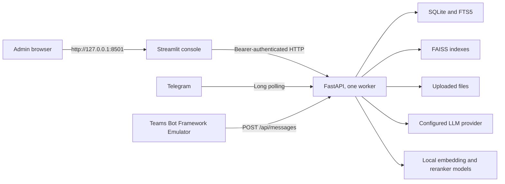

# IntelliKnow Laptop Demo Deployment

This runbook is for the administrator or DevOps person responsible for running the IntelliKnow MVP on one laptop. It uses the simplest supported topology: one API process, one admin-console process, local storage, and optional Telegram or local Teams connectivity.

The recommended commands are written for macOS and `zsh`, but the application itself is Python-based and can also run on Linux.

## 1. What will run



| Component | Runs where | Purpose |
| --- | --- | --- |
| FastAPI | Laptop, port `8000` | Ingestion, retrieval, channels, admin API |
| Streamlit | Laptop, port `8501` | Administrator interface |
| SQLite/FTS5 | `data/intelliknow.db` | Metadata, chunks, keyword search, history |
| FAISS | `data/faiss/` | Semantic vector search by intent |
| Upload storage | `data/uploads/` | Original uploaded documents |
| Embedding/reranker | Laptop | Classification centroids, semantic search, reranking |
| Anthropic | Internet | Default document classification and answer generation |
| Telegram | Internet, optional | Employee-facing chat demo |
| Teams Emulator | Same laptop, optional | Local Teams adapter demo without Azure or a tenant |

This is deliberately not a production high-availability deployment. Do not run multiple API workers: the MVP's FAISS lock is process-local.

## Daily operator card

For a laptop that has already been installed and configured:

```bash
cd /Users/aaron/workspace/intelliKnow
./scripts/laptop-demo start
# Open http://127.0.0.1:8501
# After the demo:
./scripts/laptop-demo stop
```

`start` always runs the provider preflight first. Do not bypass a failed preflight.

## 2. Laptop requirements

- macOS laptop with at least 8 GB RAM; 16 GB is more comfortable.
- At least 5 GB of free disk for Python packages, model downloads, and demo data.
- Internet access for initial installation and the configured remote LLM.
- Git and [`uv`](https://docs.astral.sh/uv/) available on `PATH`.
- An Anthropic API key for the recommended configuration.
- Optional: Telegram and Bot Framework Emulator for channel demonstrations.

Check the basics:

```bash
git --version
uv --version
df -h .
```

## 3. Install once

From Terminal:

```bash
git clone https://github.com/realAaronWu/intelliKnow.git
cd intelliKnow
./scripts/laptop-demo install
```

The helper runs `uv sync --frozen`, which installs the exact versions recorded in `uv.lock`. Re-run `install` after pulling a commit that changes `uv.lock`.

If the repository is already present:

```bash
cd /Users/aaron/workspace/intelliKnow
git pull --ff-only
./scripts/laptop-demo install
```

Do not use `git pull` while IntelliKnow is serving a demo. Stop it first.

## 4. Configure secrets on each laptop

The repository contains `.env.example`, which lists variable names but no
credentials. Every administrator creates a separate, private `.env` on the
laptop being deployed. Do not copy another user's whole `.env` file and do not
put real values in `.env.example`.

Create the private environment file:

```bash
cp .env.example .env
chmod 600 .env
```

Generate the credential-encryption key:

```bash
uv run python -c "from cryptography.fernet import Fernet; print(Fernet.generate_key().decode())"
```

Open `.env` in a text editor and set:

```dotenv
ANTHROPIC_API_KEY=your-anthropic-api-key
HF_TOKEN=your-hugging-face-read-token
HF_HUB_DISABLE_XET=0
HF_XET_HIGH_PERFORMANCE=1
ADMIN_PASSWORD=use-at-least-12-private-characters
CREDENTIAL_ENCRYPTION_KEY=paste-the-generated-fernet-key
```

Create the credentials from their official services:

| Variable | Where it comes from | Required |
| --- | --- | --- |
| `ANTHROPIC_API_KEY` | The organization's Anthropic Console account | Yes for the checked-in provider configuration |
| `HF_TOKEN` | A Read token from [Hugging Face access tokens](https://huggingface.co/settings/tokens) | Recommended for authenticated, higher-limit model downloads |
| `ADMIN_PASSWORD` | A new private password chosen for this deployment | Yes; use at least 12 characters |
| `CREDENTIAL_ENCRYPTION_KEY` | The Fernet generation command above | Yes |
| `TELEGRAM_BOT_TOKEN` | Telegram `@BotFather` | Only for a Telegram demo |
| `TEAMS_APP_ID` and `TEAMS_APP_PASSWORD` | Microsoft Entra/Azure Bot registration | Only for real Teams; not needed by the local Emulator demo |

The recommended Xet settings provide visible, resumable transfers and enable
additional download concurrency. If Xet cannot establish TLS through a
particular corporate proxy, set `HF_HUB_DISABLE_XET=1` and retry with the
standard HTTPS downloader.

For a brand-new knowledge base, generate a new Fernet key on that laptop. For
a restored or transferred `data/intelliknow.db`, securely provide the original
`CREDENTIAL_ENCRYPTION_KEY` through the organization's password manager or
secret store. A new key cannot decrypt Telegram or Teams credentials already
stored in that database.

If the laptop uses a local HTTP proxy, set all outbound proxy variables to its
HTTP URL. For the MonoProxy setup used by this demo:

```dotenv
ALL_PROXY=http://127.0.0.1:8118
HTTPS_PROXY=http://127.0.0.1:8118
HTTP_PROXY=http://127.0.0.1:8118
```

Alternatively, for a SOCKS proxy with remote DNS, use:

```dotenv
ALL_PROXY=socks5h://127.0.0.1:8119
HTTPS_PROXY=socks5h://127.0.0.1:8119
HTTP_PROXY=socks5h://127.0.0.1:8119
```

The application loads `.env` itself. Do not run `source .env`, and never commit,
email, or paste this file into chat. When several administrators need access,
share individual secrets through an approved password manager and have each
administrator construct `.env` locally from `.env.example`.

Confirm that Git will ignore the private file:

```bash
git check-ignore .env
```

This command should print `.env`.

## 5. Confirm the demo configuration

The checked-in `config.yaml` is the recommended laptop profile:

- Anthropic `claude-haiku-4-5` for classification and generation;
- local `all-MiniLM-L6-v2` embeddings;
- local cross-encoder reranking;
- Telegram polling enabled;
- Teams disabled until a Teams demo is needed;
- storage under `./data`;
- uploads limited to PDF, DOCX, and XLSX files up to 25 MB.

Avoid changing embedding model or dimension after documents are indexed. IntelliKnow rejects incompatible changes because existing vectors would no longer be valid.

## 6. Preflight before a demo

Download both local models once, before the first startup:

```bash
./scripts/laptop-demo download-models
```

This downloads and runs the configured embedding and reranker models. Do not
start the demo until it prints `Both local models are cached and executable.`
Interrupted Hugging Face transfers are resumable; rerun the same command.

Run:

```bash
./scripts/laptop-demo preflight
```

This validates the required secrets and Fernet key, then makes one real
structured LLM request, one embedding call, and one two-passage reranker call.
Startup uses cache-only mode and never downloads a model. It fails immediately
with a `download-models` instruction when either local model is absent. It also
fails when the provider, API key, model name, embedding dimension, or local
inference runtime is wrong.

Expected final line:

```text
Preflight passed.
```

The first preflight can take longer because it downloads and caches both
`sentence-transformers/all-MiniLM-L6-v2` and
`cross-encoder/ms-marco-MiniLM-L-6-v2`. Later starts reuse the cache.

## 7. Start everything

Make sure no older IntelliKnow process is running, then use one command:

```bash
./scripts/laptop-demo start
```

The helper performs these steps in order:

1. Validates files and secrets.
2. Runs the real provider preflight.
3. Starts exactly one FastAPI worker.
4. Waits for an authenticated API readiness check.
5. Starts Streamlit with the correct API URL.
6. Waits for the console port to become available.
7. Prints the URLs and log directory.

Open [http://127.0.0.1:8501](http://127.0.0.1:8501), then sign in with the value of `ADMIN_PASSWORD`.

The API documentation is available at [http://127.0.0.1:8000/docs](http://127.0.0.1:8000/docs).

Check status at any time:

```bash
./scripts/laptop-demo status
```

Follow both logs:

```bash
./scripts/laptop-demo logs
```

Press **Control-C** to stop following logs. This does not stop IntelliKnow.

## 8. Build and verify the knowledge base

1. Open **Knowledge Base** in the console.
2. Upload at least two small demo documents from different domains.
3. Wait for every document to show **Processed**.
4. Open a document and confirm its intent and extracted chunks.
5. If the classifier is unavailable or below the confidence threshold, the upload fails as **Unclassified** and indexes nothing. Fix the provider or intent definitions, then retry.
6. Use **Reassign** if a successfully classified document needs an administrator correction.
7. Open **Dashboard** and ask a question with an answer stated in one uploaded document.
8. Confirm the answer shows the expected intent, a source document, and a source location.

Recommended acceptance question for the included expense fixture:

```text
Which form should I submit for travel expenses?
```

Expected result: Finance, Form FIN-204, with `expense_policy.docx` cited.

Do not trust a plausible answer without a verified source. For HR, legal, or financial decisions, open and review the cited document.

## 9. Optional Telegram demo

Telegram is the easiest real chat demo because it uses outbound polling and needs no public URL.

1. Create the bot with Telegram's verified `@BotFather`.
2. Put `TELEGRAM_BOT_TOKEN` in `.env`, or save it in **Frontend Integration**.
3. Restart IntelliKnow:

   ```bash
   ./scripts/laptop-demo restart
   ```

4. Open the bot in Telegram, select **Start**, and ask a known-answer question.
5. Confirm the response includes a source.

Only one process may poll a Telegram bot token. If Telegram reports another `getUpdates` request, stop every other local or cloud copy using that token, wait about 30 seconds, and restart this copy.

The MVP has no Telegram user allowlist. Anyone who discovers the bot can ask it questions, so use only non-sensitive demo documents.

See [Using IntelliKnow in Telegram and Microsoft Teams](CONNECTING-TELEGRAM-AND-TEAMS.md) for complete setup.

## 10. Optional local Teams demo

For the laptop MVP, use Bot Framework Emulator. This validates the Teams adapter without Azure, public HTTPS, Microsoft 365 tenant approval, or a Teams app package.

1. In `config.yaml`, set `channels.teams.enabled` to `true`.
2. Restart IntelliKnow.
3. Open Bot Framework Emulator.
4. Connect it to `http://localhost:8000/api/messages`.
5. Leave App ID and App Password empty for this same-laptop test.
6. Send a known-answer question and verify the cited reply.

Follow [Local Microsoft Teams Demo](LOCAL-TEAMS-DEMO.md) for installation and troubleshooting. Real Teams is a separate deployment activity requiring Azure Bot, public HTTPS, and tenant approval; it is not necessary for the laptop MVP demonstration.

## 11. Stop or restart safely

Stop both components after the demo:

```bash
./scripts/laptop-demo stop
```

Restart after config or secret changes:

```bash
./scripts/laptop-demo restart
```

Do not close the laptop lid or switch networks during a channel demo. Telegram polling and remote LLM requests require a stable network connection.

## 12. Logs and runtime files

The helper stores process IDs and logs under:

```text
.run/laptop-demo/api.log
.run/laptop-demo/ui.log
```

Application data is stored under:

```text
data/intelliknow.db
data/faiss/
data/uploads/
```

Both directories are ignored by Git. Logs can contain questions and provider error details; treat them as internal data.

## 13. Backup before changing the laptop

For a consistent backup, stop IntelliKnow first:

```bash
./scripts/laptop-demo stop
mkdir -p backups
tar -czf "backups/intelliknow-data-$(date +%Y%m%d-%H%M%S).tar.gz" data config.yaml
```

Store `.env` separately in an approved password manager or secret store. A restored database with encrypted integration credentials also needs the original `CREDENTIAL_ENCRYPTION_KEY`.

To restore, stop IntelliKnow, restore `data/` and `config.yaml` together, restore the matching secrets securely, run `preflight`, then start.

## 14. Troubleshooting

| Symptom | Likely cause | Action |
| --- | --- | --- |
| `uv is not installed` | Missing prerequisite | Install `uv`, reopen Terminal, run `install` |
| Missing `.env` value | Incomplete secret setup | Fill the named value in `.env`; do not add it to `config.yaml` |
| Provider preflight fails | Key, model, proxy, or network problem | Read the exact error, verify `.env` and `config.yaml`, then rerun `preflight` |
| Hugging Face remains at zero downloaded bytes | Proxy route cannot transfer from the model CDN | Check the proxy node, then rerun `download-models`; use `HF_HUB_DISABLE_XET=1` only when Xet itself cannot establish TLS |
| Port already in use | Old process or another app | Stop it, or choose alternate ports as shown below |
| Console cannot connect | API did not start or URL mismatch | Run `status`, then inspect `api.log` and `ui.log` |
| Upload is Unclassified | Provider failed, returned invalid output, or confidence was too low | Fix provider/intent definitions and retry; no content was indexed |
| Query returns HTTP 503 | Classification was unavailable or uncertain | Clarify the question or restore the provider, then retry |
| Telegram `getUpdates` conflict | Same token is polled elsewhere | Stop the other bot instance, wait, restart one copy only |
| Telegram is silent | Token, proxy, enabled state, or network | Inspect API log and Frontend Integration errors |
| First startup is slow | Local model download/load | Keep the network connected and watch `api.log` |
| Teams says disabled | Teams config or persisted integration disabled | Enable Teams, restart, and check Frontend Integration |

Use alternate ports when `8000` or `8501` is reserved:

```bash
INTELLIKNOW_API_PORT=8012 INTELLIKNOW_UI_PORT=8502 ./scripts/laptop-demo start
```

The helper remembers the active ports for later `status`, `logs`, `restart`, and `stop` commands.

## 15. Demo acceptance checklist

- [ ] `./scripts/laptop-demo preflight` passes.
- [ ] `./scripts/laptop-demo start` reports both URLs.
- [ ] Admin sign-in rejects a wrong password and accepts the configured one.
- [ ] At least two documents show Processed with sensible intent assignments.
- [ ] A known-answer Dashboard query returns the correct intent and citation.
- [ ] An unrelated question produces no match rather than an invented answer.
- [ ] The admin knows that uncertain or unavailable classification returns a retryable error and searches no intent.
- [ ] Optional Telegram reply succeeds with exactly one poller running.
- [ ] Optional Teams Emulator reply succeeds locally.
- [ ] Analytics records the test query and cited document.
- [ ] `./scripts/laptop-demo stop` stops both managed processes.

For this MVP, passing this checklist is the deployment definition of done.
