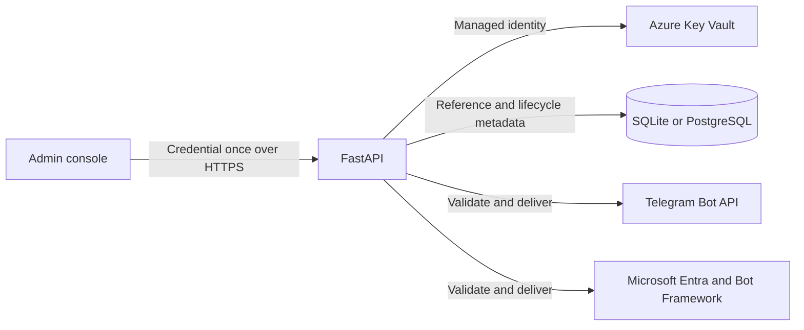

# Production Frontend Integration Credential Management

## Scope

This design covers credentials configured by an administrator for Telegram and
Microsoft Teams. Administrator login and identity management are intentionally
out of scope.

## Security objectives

- Plaintext credentials never persist in SQLite, configuration files, logs,
  analytics, backups, or API responses.
- Production secrets live in Azure Key Vault and are accessed by the API's
  managed identity. IntelliKnow holds no Key Vault access key.
- Laptop-demo secrets live in the signed-in user's macOS Keychain.
- SQLite stores only a non-secret secret name, active version, lifecycle state,
  provider identity, verification timestamps, and errors.
- A replacement is staged and provider-validated before it becomes active. A
  failed replacement leaves the current credential untouched.
- Rotation, rollback, disabling, deletion, verification, and access failures
  produce metadata-only audit records.
- A secret-manager outage fails closed when no unexpired in-memory lease exists.

## Architecture

Application code depends on a provider-neutral `SecretStore` interface. The
production implementation uses `SecretClient` with `DefaultAzureCredential`,
which resolves to managed identity in Azure. A separate vault is required per
environment, with data-plane RBAC scoped to the application vault.

## Stored data

The secret manager stores one JSON credential bundle per channel:

- Telegram: `{"token": "..."}`
- Teams client-secret mode: `{"app_id": "...", "app_password": "..."}`

The database stores only:

| Field | Purpose |
| --- | --- |
| `secret_name` | Stable non-secret vault/Keychain identifier |
| `active_secret_version` | Exact version used by channel workers |
| `previous_secret_version` | Short rollback window during rotation |
| `pending_secret_version` | Staged but not active replacement |
| `credential_type` | `bot-token`, `client-secret`, or future `certificate` |
| `credential_status` | `pending`, `verified`, `invalid`, or `unconfigured` |
| `external_identity` | Telegram bot username or Teams application ID |
| timestamps/error | Configuration and verification observability |

The legacy `credentials_encrypted` column is retained only for migration. New
writes must never populate it. Once all deployed databases have migrated and a
rollback window has passed, a later schema migration removes it.

## Credential replacement

1. Validate the exact field set and reject blank values.
2. Write the submitted bundle as a new, staged secret-manager version.
3. Verify that staged version against its provider:
   - Telegram calls `getMe` and records the returned bot ID/username.
   - Teams obtains a Bot Framework access token; certificate authentication is
     the preferred production mode when supported by the deployment.
4. In one database transaction, move the old active version to `previous`, move
   the staged version to `active`, mark it verified, and clear legacy ciphertext.
5. Invalidate the process credential cache and run an end-to-end channel test.
6. Disable the previous version after the configured rollback window.

If steps 2 or 3 fail, disable/delete the staged version, record the failure, and
leave the current active version unchanged.

## Runtime access

Channel workers resolve only the database's explicit active version. A value may
be cached in process memory for no more than five minutes. Rotation, disable,
rollback, and delete invalidate that cache immediately. Secret values are never
included in exceptions and a redacting log filter provides defense in depth.

Production mode prohibits environment and encrypted-SQLite fallback. The only
legacy exception is the explicit one-way migration at startup, which requires
the former Fernet key, writes a secret-manager version, atomically stores its
reference, and clears the ciphertext.

## Deployment modes

### Azure production

- `secret_store.provider: azure-key-vault`
- `secret_store.azure_vault_url` identifies one vault for this application and
  environment.
- `DefaultAzureCredential` uses the workload's managed identity.
- Grant a least-privilege custom data-plane role for secret get/set/version
  update. Do not grant Key Vault Administrator or permission-management roles.
- Enable vault soft delete, purge protection, diagnostic logs, private endpoint
  access where available, and alerts for denied or unusual secret operations.

### macOS laptop demo

- `secret_store.provider: macos-keychain`
- Values are stored by the operating-system Keychain backend under the
  configured service name.
- SQLite contains the same references as production, so application behavior
  and migration semantics remain aligned.

## Audit events

The append-only credential audit log records channel, action, result, secret
version, external identity, timestamp, request correlation ID, and a sanitized
error category. It never records submitted values or provider response bodies.

Actions include `staged`, `validation_failed`, `activated`, `rolled_back`,
`disabled`, `deleted`, `migrated`, and `runtime_access_failed`.

## Delivery increments

1. Introduce `SecretStore`, Azure Key Vault, macOS Keychain, and in-memory test
   implementations; add reference-only schema and one-way legacy migration.
2. Add staged provider validation and atomic activation to the admin API.
3. Add cache invalidation, rotation, rollback, emergency disable, and audit UI.
4. Add Teams certificate credentials and remove legacy ciphertext support.

## Acceptance criteria

- Inspecting the database and API responses reveals no usable credential.
- New credential writes never populate `credentials_encrypted`.
- Invalid replacements do not interrupt an active integration.
- Rotation takes effect without restarting the service.
- Secret-manager outage fails closed after the bounded cache lease expires.
- Disabling an integration invalidates its cached credential immediately.
- Telegram and Teams credentials are provider-verified before activation.
- All lifecycle operations are auditable without leaking secret material.
- Production startup rejects environment or SQLite credential fallback.

## Implementation status

Implemented in the first increment:

- Versioned Azure Key Vault, macOS Keychain, and in-memory test providers.
- Reference-only database columns and a maximum five-minute process cache.
- Fail-closed runtime reads and immediate cache invalidation on disable/delete.
- One-way, retry-safe migration from legacy Fernet ciphertext.
- Laptop startup and operator documentation that no longer require new channel
  credentials in `.env`.

Still required before the subsystem is production-complete:

- Provider validation and atomic staged activation (Task 7.4).
- Rotation, rollback, emergency disable, and append-only audit records (Task
  7.5).
- Teams certificate authentication and retirement of legacy migration code
  after the migration window (Task 7.6).

## References

- [Azure Key Vault Python quickstart](https://learn.microsoft.com/en-us/azure/key-vault/secrets/quick-create-python)
- [Azure Key Vault RBAC guidance](https://learn.microsoft.com/en-us/azure/key-vault/general/rbac-guide)
