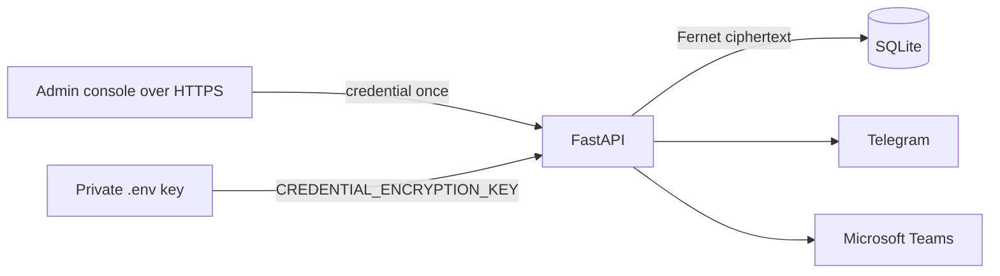

# MVP Frontend Integration Credential Storage

## Scope

This design covers the Telegram bot token and Microsoft Teams application
credentials entered by an administrator. Administrator identity is separate.
The goal is secure, portable storage appropriate to a one-person laptop MVP,
not a general secret-management platform.

## Design



- The admin enters credentials on **Frontend Integration**.
- The API validates the exact required fields and rejects blanks.
- The complete JSON bundle is encrypted with Fernet before SQLite receives it.
- `CREDENTIAL_ENCRYPTION_KEY` is loaded from the process environment or private
  `.env`; it is never stored in SQLite or `config.yaml`.
- API and UI responses contain only the last four characters.
- Saving a replacement takes effect on the next channel operation without a
  restart. Clearing it removes the ciphertext and disables the channel.
- Missing, invalid, or mismatched encryption keys fail closed with sanitized
  errors. No plaintext fallback exists.

The laptop lifecycle helper generates a valid key once when the `.env` field is
empty and validates it on every start. Operators back up the database and key
separately and restore the matching pair together.

## Threat Model

This protects against accidental disclosure through source control,
`config.yaml`, API responses, UI rendering, logs, and a database file copied
without the `.env` key. It does not protect secrets after full host compromise,
against a process-memory attacker, or when both the database and `.env` are
stolen. Those risks require deployment-level controls outside this MVP.

## Upgrade

One earlier local build stored Keychain references in SQLite. Its optional
one-time migration is:

```bash
.venv/bin/python scripts/migrate_keychain_credentials.py
```

The script reads and validates every legacy value, encrypts all values in one
database transaction, commits, and only then deletes the old Keychain items.
It is retry-safe. New installations do not use Keychain.

## Acceptance Criteria

- SQLite contains ciphertext, never the plaintext credential.
- The ciphertext decrypts only with the matching key.
- API and console output expose last four characters only.
- Wrong or missing keys stop credential access with no leaked value.
- Save, replace, clear, and process restart are covered by tests.
- Telegram and Teams use the newly saved credentials without a service restart.

## Deliberate Non-Goals

Azure Key Vault, macOS-only runtime storage, provider interfaces, secret
versions, credential caches, staged rotation, rollback, certificate-based Teams
authentication, and a credential audit dashboard are omitted. They add
infrastructure and unfinished lifecycle states without improving the core MVP
acceptance flows. A future production deployment can replace this module with
its platform secret manager when there is a concrete hosting target and threat
model.
